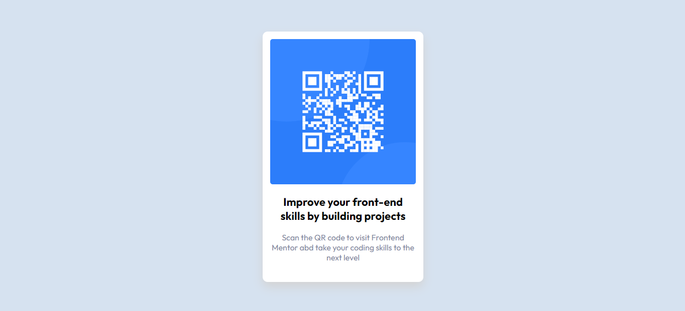

# Frontend Mentor - QR code component solution

Essa é uma solução do [QR code component challenge on Frontend Mentor](https://www.frontendmentor.io/challenges/qr-code-component-iux_sIO_H). Um desafio proposto pelo Frontend Mentor, que me ajudou a voltar a praticar minhas habilidades com o código, construindo projetos realistas.

## Tabela de conteúdos

- [Geral](#geral)
  - [Captura de Tela](#captura-de-tela)
- [Meu processo](#meu-processo)
  - [Construído com](#contruido-com)
  - [O que eu aprendi](#o-que-eu-aprendi)
  - [Desenvolvimento continuado](#desenvolvimento-continuado)
  - [Pesquisas](#pesquisas)
- [Autor](#autor)

## Geral

### Captura de Tela

## Meu processo

### Construído com

- Marcação de HTML5 semântica
- Propriedades customizadas do CSS
- Flexbox

### O que eu aprendi

Este projeto está relacionado à manutenção de habilidades já aprendidas com HTML e CSS. Estava há cerca de um mês sem praticar e foi ótimo para mim voltar à fazê-lo com este projeto. 

É um projeto simples, prático e dinâmico. A propriedade do CSS 'box-shadow' me foi uma novidade, já a tinha visto, mas nunca a utilizado e fico feliz de entender como utilizá-la. 

### Desenvolvimento continuado

O flexbox e as propriedades relacionadas a ele me ajudaram muito a criar uma boa estilização, para que alcançasse o objetivo deste exercício. Sinto que ainda não domino completamente e continuarei a utilizá-lo porque sei da importância que tem. 

### Pesquisas

- [Propriedade box-shadow, do CSS](https://developer.mozilla.org/pt-BR/docs/Web/CSS/box-shadow) - Ela me ajudou a entender como utilizar a propriedade box-shadow, do CSS. Gostei muito deste conteúdo e pretendo continuar utilizando-o para aprender mais e mais sobre esta propriedade. 

## Autor

- Linkedin - [Diassis Guerreiro](linkedin.com/in/diassis-guerreiro/)
- Instagram - [@_di4ssis](https://www.instagram.com/_di4ssis/)